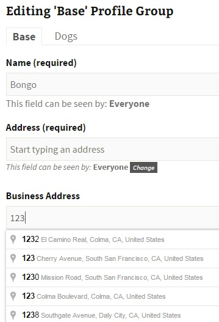
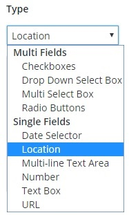
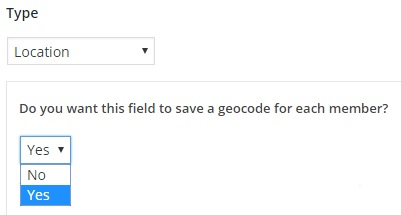

# BP-xProfile-Location
A BuddyPress plugin that creates a xProfile Location field type that uses the Google Places API

Creates an xProfile Location field type that use the Google Places API to populate and validate the address fields.
The result will be *uniform* and *searchable* addresses with a *single* input field.

You can create multiple Location fields via *wp-admin > Users > Profile Fields > Add New Field*

The xprofile field for each member will be populated as a searchable string.

A latitude / longitude 'geocode' will be saved as a separate field, if that option was selected when the field was created.

You can then use the geocode in your preferred Member Map solution.

Or you may be interested in this **Member Map** solution: [BP Maps for Members](http://www.philopress.com/bp-maps-for-members "BP Maps for Members")

For BuddyPress **Group Maps**, please see: [BP Maps for Groups](http://www.philopress.com/bp-maps-for-groups "BP Maps for Groups")

For more information about this plugin, please visit [BP xProfile Location](http://www.philopress.com/products/bp-xprofile-location/ "BP xProfile Location")

The Edit screen on a member profile with Address Auto-Complete

Creating a Profile Field of Type > Location

GeoCode option when creating a Profile Field

= Do I need a Google Maps API Key? =
* Yes. If you need help, read this tutorial: [Google Maps API Key](http://www.philopress.com/google-maps-api-key/ "Google Maps API Key")

= I have a Google Maps API Key. Where do I put it? =
* Go to wp-admin > Settings > BuddyPress > Options. Under 'Profile Settings', find 'Google Maps API key', enter your key and Save. 

